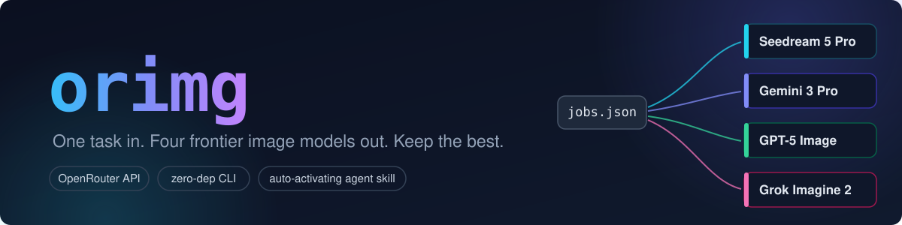
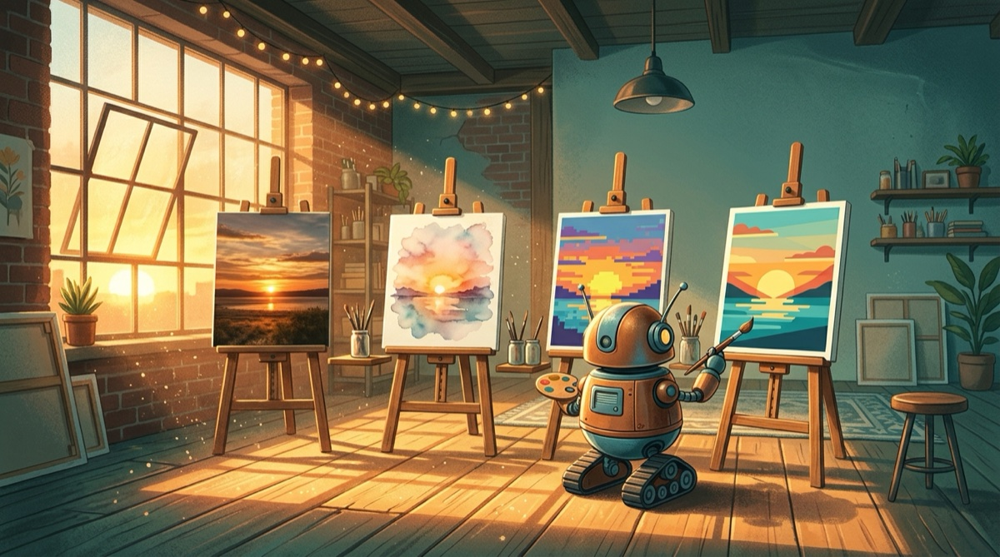
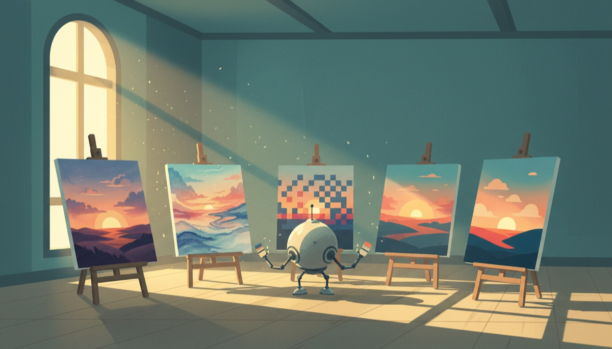
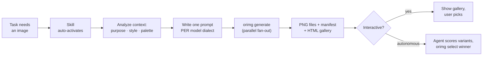

<p align="center">
  
</p>

<h1 align="center">orimg</h1>

<p align="center">
  <b>One task in, four frontier image models out, keep the best.</b><br/>
  Multi-model image generation for AI agents and humans, powered by <a href="https://openrouter.ai">OpenRouter</a>.
</p>

<p align="center">
  <a href="https://www.npmjs.com/package/orimg"></a>
  <a href="https://github.com/voftik/orimg/actions/workflows/ci.yml"></a>
  <a href="LICENSE"></a>
  = 20">
  
  <a href="CONTRIBUTING.md"></a>
</p>

---

Every image model has a personality. **Seedream 5.0 Pro** designs layouts like a poster artist. **Gemini 3 Pro Image** renders text nobody else can. **GPT Image 2** follows a 15-object brief to the letter. **Grok Imagine 2.0** is fast, cheap, and moody. Why gamble on one when you can ask all four, each with a prompt written in its own dialect, and simply keep the winner?

`orimg` is a zero-dependency TypeScript CLI **plus an [Agent Skill](#the-agent-skill)** that makes Claude Code and OpenAI Codex do this autonomously: analyze the task, write per-model prompts, fan out in parallel through one OpenRouter API key, save files to disk, build a comparison gallery, and either ask you to pick or judge the variants and pick for you.

```
$ orimg generate --jobs jobs.json

  ✓ bytedance-seed/seedream-5-0-pro     hero-seedream-5-0-pro-1.png     $0.045   14.2s
  ✓ google/gemini-3-pro-image           hero-gemini-3-pro-image-1.png   $0.134   11.8s
  ✓ openai/gpt-image-2                  hero-gpt-image-2-1.png          $0.098   19.8s
  ✓ x-ai/grok-imagine-image-2.0         hero-grok-imagine-2-0-1.png     $0.041    6.9s

  4/4 models · total $0.387 · gallery: ai-images/20260817-hero/index.html
```

## Get started in 60 seconds

```bash
npx -y orimg setup
```

That's the whole install. An interactive wizard will:

1. **Ask for your [OpenRouter API key](https://openrouter.ai/keys)**: input is hidden, the key is validated live against the API and stored in `~/.config/orimg/config.json` with `600` permissions. One key unlocks every model.
2. **Install the auto-activating agent skill** for **Claude Code** (`~/.claude/skills/`) and **Codex** (`~/.agents/skills/`), both by default; it detects what you have.
3. **Let you pick a default model lineup**: flagship four (~$0.35/batch) or budget duo (~$0.08/batch).

Then open any project and just ask your agent:

> "Build the landing page. It needs a hero background."

No commands, no flags: the agent activates the skill on its own, writes per-model prompts, generates, compares, and delivers the winner. Verify anytime with `orimg doctor`.

<details>
<summary>Non-interactive / CI install</summary>

```bash
npm install -g orimg
export OPENROUTER_API_KEY=sk-or-...   # or put {"apiKey": "sk-or-..."} in ~/.config/orimg/config.json
orimg setup --yes                     # installs the skill for both agents, no prompts
orimg doctor --json
```

Re-run `orimg setup` (or `--yes`) after upgrading: it refreshes the installed skill when the version changes.

</details>

## Showcase

One brief, *"a tiny robot artist painting the same sunset in four styles"*, dispatched by orimg with a model-specific prompt for each model. Generated by orimg itself, total actual cost **$0.24**:

| `google/gemini-3-pro-image` · $0.135 | `google/gemini-3.1-flash-image` · $0.068 | `google/gemini-2.5-flash-image` · $0.039 |
|---|---|---|
|  |  |  |
| Precise brief adherence: exactly 4 easels, 4 distinct styles | Richer character, denser scene | Went minimalist and painted **5** easels |

Same words, three different artists. This is exactly why you fan out instead of betting on one model. Every batch also gets a self-contained `index.html` comparison gallery with per-variant prompts, parameters, real costs and timings.

## Why this exists

There was no tool that does **multi-model fan-out with comparison**. We checked ([~15 OpenRouter image MCPs](https://github.com/search?q=openrouter+image+mcp), the official OpenRouter MCP, every image skill on the market):

| | orimg | Official OpenRouter MCP | Single-model skills (nano-banana &amp; co) | Typical image MCP servers |
|---|:---:|:---:|:---:|:---:|
| Several models per request, in parallel | yes | no | no | no |
| Per-model prompt dialects | yes | no | no | no |
| Files on disk (agent-friendly) | yes | no, inline base64 | yes | varies |
| Context cost per image in Claude Code | **~0 tokens** (path) | ~15–25k tokens¹ | ~0 | often 15–25k¹ |
| HTML comparison gallery + manifest with real costs | yes | no | no | no |
| Auto-activates in Claude Code **and** Codex | yes, skill | no | Claude only | no |
| Autonomous winner selection | yes | no | no | no |

¹ MCP `ImageContent` results are counted as base64 text in Claude Code ([anthropics/claude-code#31208](https://github.com/anthropics/claude-code/issues/31208)). orimg never puts image bytes into the model context: agents get file paths and read only what they need.

## Features

- **Fan-out generation**: one jobs file, N models, parallel requests, partial-failure tolerant (3 of 4 succeeded? You get 3 images and a clean report).
- **Prompt dialects**: the bundled skill teaches agents how Seedream, Gemini, GPT Image and Grok each want to be prompted, with sourced, up-to-date guides.
- **Agent-native**: auto-activating skill for Claude Code (`~/.claude/skills`) and Codex (`~/.agents/skills`); stable JSON envelope, distinct exit codes, absolute paths.
- **Comparison gallery**: a self-contained `index.html` per batch shows every variant with its model, parameters, cost and timing, side by side.
- **Honest manifests**: `manifest.json` records prompts, seeds, per-job **actual** cost from `usage.cost`, and timings.
- **Cost-aware**: `--dry-run` estimates before spending; the default four cost ≈ $0.35 per full fan-out.
- **Zero runtime dependencies**: built-in `fetch` and `node:util` parseArgs. Install fast, audit in one sitting.
- **Any OpenRouter model**: 48 image models and counting; unknown IDs pass through, `orimg models --search flux` to discover.

## Using the CLI directly

The agents drive orimg through the skill, but it's a first-class CLI for humans too.

Quick one-model shot:

```bash
orimg generate -m google/gemini-2.5-flash-image \
  -p "a red circle on a white background" --resolution 1K
```

Full fan-out, one prompt **per model**, each in its dialect:

```jsonc
// jobs.json
{
  "schema_version": 1,
  "task": "hero image for SaaS landing",
  "defaults": { "aspect_ratio": "16:9", "resolution": "2K", "quality": "high" },
  "jobs": [
    { "model": "bytedance-seed/seedream-5-0-pro",
      "prompt": "A wide cinematic hero illustration for a developer-tools landing page. Foreground: ... (organized narrative, up to 600 words)" },
    { "model": "google/gemini-3-pro-image",
      "prompt": "A photorealistic wide shot of a minimal workspace at golden hour. The scene features ... Shot from a low angle with a 35mm lens." },
    { "model": "openai/gpt-image-2",
      "prompt": "SCENE: minimal developer workspace...\nSTYLE: editorial, muted palette\nCONSTRAINTS: no people, no readable text\nPURPOSE: website hero, right side reserved for headline" },
    { "model": "x-ai/grok-imagine-image-2.0",
      "prompt": "Photorealistic photograph of a minimal workspace at dawn, shot on a Canon EOS R5, 35mm f/2.0, soft directional window light..." }
  ]
}
```

```bash
orimg generate --jobs jobs.json --open
```

## The Agent Skill

The reason this project exists. After `orimg setup`, Claude Code and Codex **activate the skill on their own** whenever a task needs an image, with no slash command and no reminder:

> **You:** "Build the landing page. It needs a hero background."
>
> **Agent:** *reads your CSS to match the palette → picks 16:9 / 2K / high → writes four dialect-specific prompts → runs `orimg generate` → reads the four results → picks the winner (or shows you the gallery) → wires it into the page → reports the actual $0.39 spent.*



The skill ships with prompt-engineering guides sourced from the official Google, OpenAI, ByteDance and xAI documentation; the agent reads them on demand:

| Reference | What the agent learns |
|---|---|
| [`prompt-principles.md`](skill/references/prompt-principles.md) | The 2026 universal skeleton: narrative &gt; tags, semantic negatives, camera language, sizes only via API params |
| [`seedream-5-pro.md`](skill/references/seedream-5-pro.md) | 600-word organized narratives, layout-aware typography in 14 languages, imperfection-engineered realism |
| [`gemini-3-pro-image.md`](skill/references/gemini-3-pro-image.md) | Google's official narrative templates, best-in-class text rendering, conversational editing |
| [`gpt-5-image.md`](skill/references/gpt-5-image.md) | Labeled sections, preserve-lists, verbatim text, `gpt-image-2` vs hybrid differences |
| [`grok-imagine-2.md`](skill/references/grok-imagine-2.md) | The mandatory photo anchor against anime drift, camera language, social formats |
| [`model-guide.md`](skill/references/model-guide.md) | Which models to pick for posters vs icons vs photorealism vs cheap drafts |

## CLI reference

| Command | What it does |
|---|---|
| `orimg generate --jobs <file\|->` | Fan-out generation from a jobs file (or stdin) |
| `orimg generate -m <model> -p "<prompt>"` | Quick single-model generation |
| `orimg models [--search <term>]` | List OpenRouter image models with prices &amp; supported params |
| `orimg select <batch> <model> --to <dest>` | Copy the chosen variant into place, record the choice |
| `orimg setup` | Install the agent skill into Claude Code + Codex |
| `orimg doctor` | Verify key, API reachability, skill installation |

<details>
<summary><b>Flags, JSON envelope &amp; exit codes</b> (for agents and CI)</summary>

**Flags:** `--out <dir>` `--concurrency 4` `--timeout 180` `--retries 2` `--json` `--dry-run` `--strict` `--open` `--no-gallery` `--ref <url|path>` `--aspect-ratio` `--resolution` `--quality` `--seed` `-n`

**When stdout is not a TTY (or with `--json`)** orimg emits a stable envelope:

```json
{ "schema_version": 1, "success": true,
  "data": {
    "batch_dir": "/abs/path", "manifest": "/abs/path/manifest.json",
    "gallery": "/abs/path/index.html",
    "images": [{ "model": "…", "path": "/abs/….png", "cost_usd": 0.045,
                 "duration_ms": 14200, "params": { "aspect_ratio": "16:9" } }],
    "failed": [{ "model": "…", "error": "…", "code": "TIMEOUT", "retries": 2 }],
    "totals": { "cost_usd": 0.387, "images": 4, "failed": 0 }
  },
  "error": null }
```

**Exit codes:** `0` success (incl. partial) · `2` validation · `3` auth · `4` all jobs failed · `1` unexpected. `--strict` turns partial success into `4`.

**Config cascade:** flags → `OPENROUTER_API_KEY` / `ORIMG_*` env → `./.env` → `~/.config/orimg/config.json`.

</details>

## Default model lineup

| Model | ~$/image | Strong at |
|---|---|---|
| `bytedance-seed/seedream-5-0-pro` | ~$0.045 | Poster-grade layouts, typography in 14 languages |
| `google/gemini-3-pro-image` | ~$0.134 | Best text rendering &amp; infographics, 14 reference images |
| `openai/gpt-image-2` | ~$0.03–0.13 | Newest OpenAI flagship: strictest instruction following, full aspect-ratio set, identity-preserving edits |
| `x-ai/grok-imagine-image-2.0` | ~$0.041 | Fast, cheap, social formats, creative moods |

Swap any of them: every OpenRouter image model ID works, including budget stars like `google/gemini-2.5-flash-image` (~$0.04). See [model-guide.md](skill/references/model-guide.md).

## Design principles

1. **Files first.** Terminal agents can't render images, and base64-in-context burns tokens. Everything lands on disk; the context gets paths.
2. **The agent writes the prompts, the CLI moves the bytes.** Intelligence lives in the skill (a plain-markdown, model-readable spec); the CLI is a deterministic, testable transport.
3. **Partial success is success.** One flaky provider never kills the batch.
4. **Real costs, not estimates.** Every manifest records what OpenRouter actually charged.
5. **Zero runtime dependencies.** Nothing to audit but this repo.

## Troubleshooting

<details>
<summary><b>Fast models succeed, slow ones fail with <code>NETWORK: read ECONNRESET</code></b></summary>

Some VPNs, proxies and DPI middleboxes silently kill HTTPS connections that stay open longer than ~30 s. Image generation is a single long request: models that answer fast (Gemini Flash, Grok) squeeze under the limit, slower ones (Seedream, GPT Image at high quality) get reset every time. orimg retries transient network errors automatically, but if a model *always* takes longer than your network allows, no retry helps. Fixes: switch the VPN node/protocol or network, lower `resolution`/`quality` for the slow model, or temporarily drop it from the fan-out.

</details>

<details>
<summary><b><code>HTTP 400: ... aspect_ratio: not supported</code></b></summary>

Parameter support differs per model: `openai/gpt-5-image` only accepts `1:1`/`3:2`/`2:3`/`auto` (use `openai/gpt-image-2` for 16:9). Check `orimg models <model-id>` for the authoritative `supported_parameters`. The batch continues: other jobs are unaffected.

</details>

## Roadmap

- [ ] `orimg edit`: first-class image-to-image / editing workflow with reference images
- [ ] Sixel/iTerm2 inline previews for humans in fancy terminals
- [ ] Video generation fan-out (Veo / Sora / Grok video via OpenRouter)
- [ ] Per-model A/B stats: which model wins your picks over time
- [ ] Plugin packaging for the Claude Code marketplace

## Contributing

PRs are very welcome. This project was born from the gap between what agents need and what exists. Good first issues: new model dialect guides, gallery UX, provider quirks. See [CONTRIBUTING.md](CONTRIBUTING.md).

```bash
git clone https://github.com/voftik/orimg && cd orimg
npm install && npm run build && npm test     # zero-cost: tests run against a local mock
SMOKE=1 npm run smoke                        # optional: one real ~$0.04 request
```

## License

[MIT](LICENSE) © [voftik](https://github.com/voftik)

---

<p align="center">
  If orimg saved you a "which model should I use?" spiral, <b>star the repo</b> so others find it.
</p>
